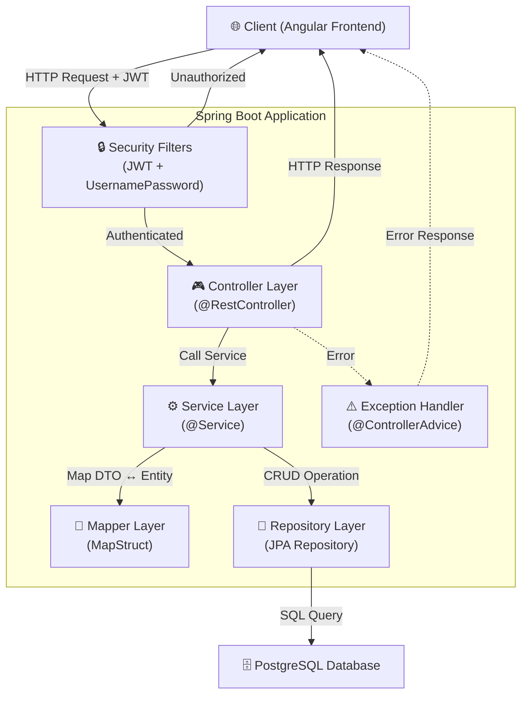
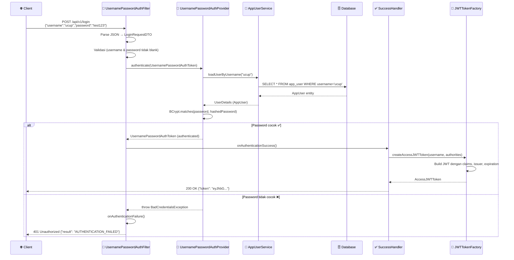
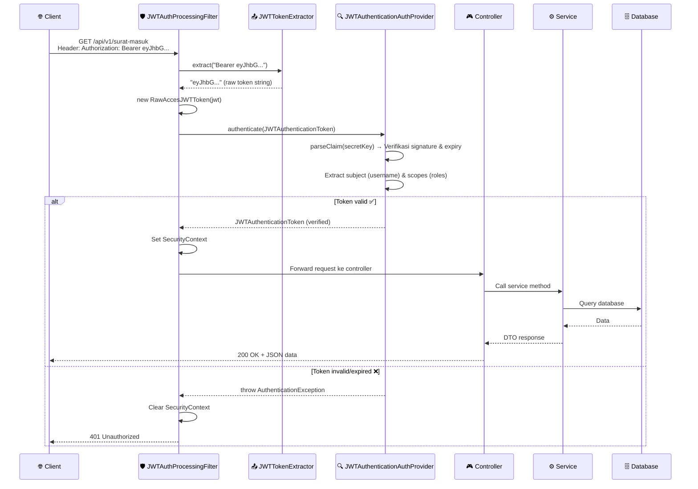
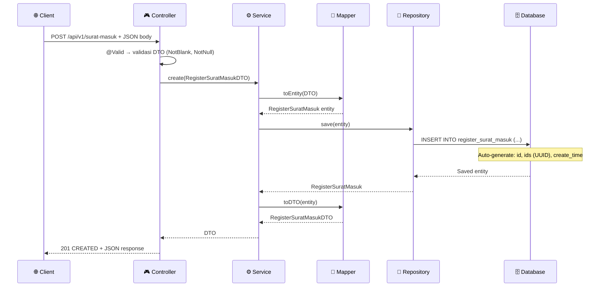
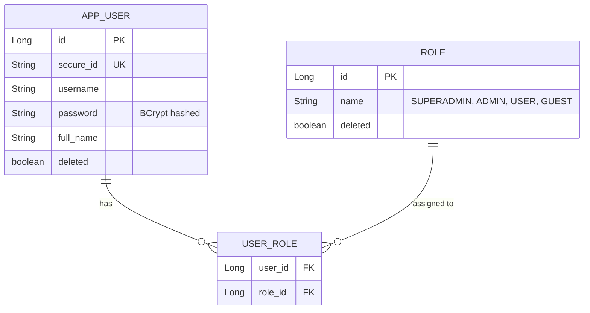

# 📖 Penjelasan Detail: BDI Backend API

## 1. Gambaran Umum

**BDI (Bank Data Intelijen)** adalah sebuah REST API backend yang dibangun menggunakan **Spring Boot 3.5.6** untuk mengelola data intelijen di **Kejaksaan Negeri Palu**. Aplikasi ini berfungsi sebagai backend service yang menyediakan API bagi frontend (Angular, berjalan di port `4200`) untuk melakukan operasi CRUD terhadap berbagai jenis register/dokumen intelijen.

> [!IMPORTANT]
> Project ini menggunakan arsitektur **Stateless REST API** dengan autentikasi **JWT (JSON Web Token)**, yang berarti tidak ada session di server — setiap request harus menyertakan token JWT di header `Authorization`.

---

## 2. Tech Stack

| Teknologi | Versi | Fungsi |
|---|---|---|
| **Java** | 21 | Bahasa pemrograman |
| **Spring Boot** | 3.4.4 | Framework utama |
| **Spring Security** | (bawaan) | Autentikasi & otorisasi |
| **Spring Data JPA** | (bawaan) | ORM & akses database |
| **PostgreSQL** | 17+ | Database relasional |
| **JJWT** | 0.12.6 | Library JWT token |
| **Lombok** | (bawaan) | Mengurangi boilerplate code |
| **MapStruct** | 1.6.3 | Mapping Entity ↔ DTO |
| **Maven** | 3.9+ | Build tool & dependency management |
| **BCrypt** | (bawaan) | Hashing password |
| **HikariCP** | (bawaan) | Connection pooling database |
| **SpringDoc OpenAPI** | 2.8.5 | Dokumentasi API otomatis (Swagger) |

---

## 3. Struktur Package

```
id.go.kejaripalu.bdi/
├── BdiApplication.java              ← Entry point aplikasi
├── config/
│   ├── ApplicationConfig.java       ← Bean configuration (JWT key, BCrypt, ObjectMapper)
│   ├── ApplicationProperties.java   ← Custom properties (app.*)
│   └── SecurityConfig.java          ← Spring Security filter chain & CORS
├── controller/                      ← REST Controller (14 controller)
│   ├── UserController.java
│   ├── RegisterSuratMasukController.java
│   ├── RegisterSuratKeluarController.java
│   ├── RegisterArsipController.java
│   ├── RegisterEkspedisiController.java
│   ├── RegisterKegiatanIntelijenController.java
│   ├── RegisterKegiatanIntelijenPamstraController.java
│   ├── RegisterKerjaIntelijenController.java
│   ├── RegisterOperasiIntelijenController.java
│   ├── RegisterPenkumLuhkumController.java
│   ├── RegisterProdukIntelijenController.java
│   ├── RegisterTamuPPHPPMController.java
│   ├── RegisterTelaahanIntelijenController.java
│   └── DataPetaController.java
├── domain/                          ← JPA Entity / Model (14 entity)
│   ├── BaseEntity.java              ← Superclass (ids, deleted, timestamps)
│   ├── RegisterSuratMasuk.java
│   ├── RegisterSuratKeluar.java
│   ├── RegisterArsip.java
│   ├── RegisterEkspedisi.java
│   ├── RegisterKegiatanIntelijen.java
│   ├── RegisterKegiatanIntelijenPamstra.java
│   ├── RegisterKerjaIntelijen.java
│   ├── RegisterOperasiIntelijen.java
│   ├── RegisterPenkumLuhkum.java
│   ├── RegisterProdukIntelijen.java
│   ├── RegisterTamuPPHPPM.java
│   ├── RegisterTelaahanIntelijen.java
│   └── DataPeta.java
├── dto/                             ← Data Transfer Object (13 DTO, Java Record)
├── mapper/                          ← MapStruct Mapper (13 mapper)
├── repository/                      ← Spring Data JPA Repository (13 repository)
├── service/                         ← Service interface
│   ├── CrudGenericService.java      ← Generic CRUD interface
│   ├── RegisterSuratService.java    ← Extended untuk register surat
│   └── impl/                       ← Service implementation
├── exception/                       ← Exception handling
│   ├── BDIErrorResponse.java        ← Error response model
│   ├── BadRequestException.java
│   ├── NotFoundException.java
│   └── RestExceptionHandler.java    ← Global @ControllerAdvice
├── security/                        ← Modul keamanan (JWT + Spring Security)
│   ├── domain/
│   │   ├── AppUser.java             ← Entity user (implements UserDetails)
│   │   ├── Role.java                ← Entity role (implements GrantedAuthority)
│   │   └── util/BaseEntity.java
│   ├── dto/
│   │   ├── LoginRequestDTO.java
│   │   └── AppUserDetailResponseDTO.java
│   ├── filter/
│   │   ├── UsernamePasswordAuthProcessingFilter.java  ← Filter login
│   │   └── JWTAuthProcessingFilter.java               ← Filter JWT setiap request
│   ├── handler/
│   │   ├── UsernamePasswordAuthSuccessHandler.java     ← Buat token saat login sukses
│   │   └── UsernamePasswordAuthFailureHandler.java     ← Response saat login gagal
│   ├── model/
│   │   ├── Token.java
│   │   ├── AccessJWTToken.java
│   │   ├── RawAccesJWTToken.java
│   │   ├── JWTAthenticationToken.java
│   │   └── AnonymousAuthentication.java
│   ├── provider/
│   │   ├── UsernamePasswordAuthProvider.java  ← Verifikasi username + password
│   │   └── JWTAuthenticationAuthProvider.java ← Verifikasi & parsing JWT token
│   ├── repository/
│   │   └── AppUserRepository.java
│   ├── service/
│   │   ├── AppUserService.java
│   │   └── impl/AppUserServiceImpl.java
│   └── util/
│       ├── JWTTokenFactory.java           ← Membuat JWT token
│       ├── JWTTokenExtractor.java
│       ├── JWTTokenHeaderExtractor.java   ← Extract token dari header
│       └── SkipPathRequestMatcher.java    ← Menentukan path yg di-skip
└── util/                            ← Enum & utility
    ├── JenisSurat.java              ← BIASA, RAHASIA
    ├── BidangDirektorat.java
    ├── JenisKelamin.java
    ├── JenisPelayanan.java
    ├── JenisProdukIntelijen.java
    ├── JenisKegiatanPenkumLuhkum.java
    ├── ProgramPenkumLuhkum.java
    ├── HasilPamstra.java
    ├── Sektor.java
    ├── GetBidangDirektorat.java
    └── ParserDateUtil.java          ← Parsing string → Date
```

---

## 4. Arsitektur Aplikasi (Layered Architecture)

Aplikasi ini menggunakan pola **Layered Architecture** klasik Spring Boot:



### Penjelasan tiap Layer:

| Layer | Tanggung Jawab |
|---|---|
| **Security Filters** | Mengintercept setiap request. Endpoint `/api/v1/login` ditangani oleh `UsernamePasswordAuthProcessingFilter`. Endpoint lainnya ditangani oleh `JWTAuthProcessingFilter` yang memvalidasi JWT token. |
| **Controller** | Menerima HTTP request, mendelegasikan ke Service layer, dan mengembalikan HTTP response. |
| **Service** | Business logic — create, update, delete (soft delete), find, search. |
| **Mapper** | Konversi antara Entity (JPA) dan DTO (response/request) menggunakan MapStruct. |
| **Repository** | Akses database via Spring Data JPA. Menjalankan query JPQL custom. |
| **Exception Handler** | Menangkap exception global dan mengembalikan response error yang konsisten. |

---

## 5. Alur Kerja Autentikasi (Login Flow)

Berikut adalah alur lengkap ketika user melakukan login:



### Detail Proses:

1. **Client** mengirim `POST /api/v1/login` dengan body `{"username", "password"}`
2. **UsernamePasswordAuthProcessingFilter** mengintercept request karena URL-nya cocok
3. Filter mem-parse JSON body menjadi `LoginRequestDTO`
4. Membuat `UsernamePasswordAuthenticationToken` dan menyerahkan ke `AuthenticationManager`
5. **UsernamePasswordAuthProvider** menerima token:
   - Memanggil `AppUserService.loadUserByUsername()` untuk mencari user di database
   - Membandingkan password menggunakan **BCrypt**
6. Jika berhasil → **SuccessHandler** membuat JWT token via `JWTTokenFactory`:
   - Claims berisi: `sub` (username), `scopes` (roles), `iss` (issuer), `iat`, `exp`
   - Token di-sign dengan HMAC-SHA key dari `RANDOM_CODE`
   - Token expired setelah **60 menit** (dev) atau **720 menit** (prod)
7. Response: `{"token": "eyJhbG..."}`

---

## 6. Alur Kerja Akses API (JWT Validation Flow)

Setiap request ke endpoint yang di-protect (`/api/v1/**`) melalui proses berikut:



---

## 7. Alur Kerja CRUD (Contoh: Surat Masuk)

### 7.1 CREATE (POST)



### 7.2 UPDATE (PUT)

```
Client → Controller → Service:
  1. findByIdsAndDeletedFalse(ids) → cari entity berdasarkan UUID
  2. Jika tidak ditemukan → throw NotFoundException("ID_NOT_FOUND")
  3. Set semua field dari DTO ke entity yang ditemukan
  4. repository.save(entity) → UPDATE query
  5. Map entity → DTO → return 200 OK
```

### 7.3 DELETE (Soft Delete)

```
Client → Controller → Service:
  1. findByIdsAndDeletedFalse(ids) → cari entity
  2. entity.setDeleted(true)   ← TIDAK benar-benar dihapus dari DB!
  3. Modify nomorSurat ← prefix dengan UUID agar unique constraint tidak conflict
  4. repository.save(entity)
  5. return 202 ACCEPTED
```

> [!NOTE]
> **Soft Delete**: Data TIDAK pernah benar-benar dihapus dari database. Field `deleted` di-set `true`, sehingga data masih bisa di-recovery. Semua query read menggunakan kondisi `deleted=false`.

### 7.4 READ (GET)

Terdapat 3 jenis operasi read:

| Operasi | Endpoint | Deskripsi |
|---|---|---|
| **Find All** | `GET /surat-masuk?pages=0&sizes=20&jenisSurat=BIASA&startDate=...&endDate=...` | Paginasi + filter jenis surat + rentang tanggal |
| **Find By ID** | `GET /surat-masuk/{ids}/detail` | Cari berdasarkan UUID (`ids`) |
| **Search** | `GET /surat-masuk/search?value=...&...` | Pencarian teks pada field `asal`, `nomorSurat`, `perihal` (case-insensitive LIKE) |

---

## 8. Model Data (Entity Relationship)

### 8.1 BaseEntity (Superclass)

Semua entity domain mewarisi `BaseEntity` yang memiliki:

| Field | Tipe | Deskripsi |
|---|---|---|
| `ids` | `String` (UUID) | ID publik yang diekspos ke client (bukan primary key) |
| `deleted` | `boolean` | Flag soft delete (default: `false`) |
| `createAt` | `LocalDateTime` | Timestamp pembuatan (auto) |
| `updateAt` | `LocalDateTime` | Timestamp update terakhir (auto) |

> [!TIP]
> Primary key (`id` tipe `Long`) disembunyikan dari API response menggunakan `@JsonIgnore`. Yang diekspos ke client adalah `ids` (UUID) untuk keamanan — mencegah enumeration attack.

### 8.2 User & Role (Autentikasi)



### 8.3 Otorisasi (Role-Based Access Control)

| Role | GET | POST | PUT | DELETE |
|---|---|---|---|---|
| **SUPERADMIN** | ✅ | ✅ | ✅ | ✅ |
| **ADMIN** | ✅ | ✅ | ✅ | ✅ |
| **USER** | ✅ | ✅ | ✅ | ✅ |
| **GUEST** | ✅ | ❌ | ❌ | ❌ |

### 8.4 Domain Entities (Register)

Terdapat **13 domain entity** yang masing-masing merepresentasikan jenis register/dokumen:

| No | Entity | Tabel | Deskripsi |
|---|---|---|---|
| 1 | `RegisterSuratMasuk` | `register_surat_masuk` | Register surat masuk (BIASA/RAHASIA) |
| 2 | `RegisterSuratKeluar` | `register_surat_keluar` | Register surat keluar |
| 3 | `RegisterArsip` | `register_arsip` | Register arsip dokumen |
| 4 | `RegisterEkspedisi` | `register_ekspedisi` | Register ekspedisi pengiriman |
| 5 | `RegisterKegiatanIntelijen` | `register_kegiatan_intelijen` | Register kegiatan intelijen |
| 6 | `RegisterKegiatanIntelijenPamstra` | `register_kegiatan_intelijen_pamstra` | Register kegiatan intelijen pengamanan strategis |
| 7 | `RegisterKerjaIntelijen` | `register_kerja_intelijen` | Register kerja intelijen |
| 8 | `RegisterOperasiIntelijen` | `register_operasi_intelijen` | Register operasi intelijen |
| 9 | `RegisterPenkumLuhkum` | `register_penkum_luhkum` | Register penerangan & penyuluhan hukum |
| 10 | `RegisterProdukIntelijen` | `register_produk_intelijen` | Register produk intelijen |
| 11 | `RegisterTamuPPHPPM` | `register_tamu_pph_ppm` | Register tamu PPH/PPM |
| 12 | `RegisterTelaahanIntelijen` | `register_telaahan_intelijen` | Register telaahan intelijen |
| 13 | `DataPeta` | `data_peta` | Data peta/lokasi |

---

## 9. Pola Desain yang Digunakan

### 9.1 Generic Service Pattern

```java
// Interface generik untuk CRUD basic
public interface CrudGenericService<T> {
    T create(T request);
    T update(String ids, T request);
    T findByIds(String ids);
    void delete(String ids);
}

// Extended interface untuk register surat (tambah paginasi & search)
public interface RegisterSuratService<T> extends CrudGenericService<T> {
    Page<T> findAll(String startDate, String endDate, String jenisSurat, Integer pages, Integer sizes);
    Page<T> findBySearching(String start, String end, String value, String jenisSurat, Integer pages, Integer sizes);
}
```

### 9.2 DTO Pattern (Java Record)

DTO menggunakan **Java Record** (immutable) dengan validasi Bean Validation:

```java
public record RegisterSuratMasukDTO(
    String ids,                          // Read-only, di-generate oleh server
    @JsonFormat(...) Date tanggalPenerimaanSurat,
    @NotBlank String asal,
    @NotBlank String nomorSurat,
    @NotNull JenisSurat jenisSurat,
    // ... field lainnya
) {}
```

### 9.3 MapStruct Mapper Pattern

```java
@Mapper
public interface RegisterSuratMasukMapper {
    RegisterSuratMasukMapper INSTANCE = Mappers.getMapper(RegisterSuratMasukMapper.class);
    RegisterSuratMasukDTO toDTO(RegisterSuratMasuk entity);
    RegisterSuratMasuk toEntity(RegisterSuratMasukDTO dto);
}
```

> MapStruct generate kode mapping pada saat **compile-time**, sehingga lebih performant dibanding reflection-based mapper (seperti ModelMapper).

---

## 10. Konfigurasi Aplikasi

### Environment Variables

| Variable | Contoh | Deskripsi |
|---|---|---|
| `DB_URL` | `jdbc:postgresql://localhost:5432/bdi` | URL koneksi database |
| `DB_USERNAME` | `postgres` | Username database |
| `DB_PASSWORD` | `secret` | Password database |
| `ISSUER` | `www.timposulabs.com` | Issuer pada JWT token |
| `ORIGIN_URL` | `http://localhost:4200` | CORS allowed origin (frontend) |
| `RANDOM_CODE` | `XRND8dD8M3K...` | Secret key untuk sign JWT (Base64) |

### Profiles

| Profile | Port | Token Expired | CORS Origin |
|---|---|---|---|
| **dev** | `8888` | 60 menit | `localhost:4200, 192.168.1.13:4200` |
| **prod** | `8181` | 720 menit (12 jam) | Dari `ORIGIN_URL` env |

### Database Configuration

- **DDL Auto**: `update` — Hibernate otomatis membuat/mengupdate tabel sesuai entity
- **Connection Pool**: HikariCP dengan max 10 koneksi
- **Timezone**: `GMT+8` (Asia/Makassar — WITA)

---

## 11. Ringkasan Alur Kerja End-to-End

```
┌─────────────────────────────────────────────────────────────────────────┐
│                        ALUR KERJA LENGKAP                              │
├─────────────────────────────────────────────────────────────────────────┤
│                                                                         │
│  1️⃣  USER LOGIN                                                        │
│     POST /api/v1/login → Filter → Provider → BCrypt → JWT Token        │
│                                                                         │
│  2️⃣  USER AKSES API (dengan token)                                     │
│     GET/POST/PUT/DELETE /api/v1/*                                       │
│     → JWT Filter → Extract Token → Verify Signature → Parse Claims     │
│     → Set SecurityContext → Forward ke Controller                       │
│                                                                         │
│  3️⃣  CONTROLLER menerima request                                       │
│     → Validasi @Valid → Delegasi ke Service                            │
│                                                                         │
│  4️⃣  SERVICE menjalankan business logic                                │
│     → MapStruct (DTO ↔ Entity) → Repository.save/find/delete          │
│                                                                         │
│  5️⃣  REPOSITORY menjalankan query ke PostgreSQL                       │
│     → JPA/JPQL Custom Query → Return result                            │
│                                                                         │
│  6️⃣  RESPONSE dikembalikan ke client                                   │
│     → Entity → DTO → JSON → HTTP Response                              │
│                                                                         │
│  ⚠️  JIKA ERROR                                                         │
│     → RestExceptionHandler @ControllerAdvice                            │
│     → BDIErrorResponse {status, message, timestamp}                     │
│                                                                         │
└─────────────────────────────────────────────────────────────────────────┘
```

---

## 12. Daftar Lengkap API Endpoint

### Authentication
| Method | Endpoint | Deskripsi | Auth |
|---|---|---|---|
| `POST` | `/api/v1/login` | Login, mendapatkan JWT token | ❌ Public |
| `GET` | `/api/v1/user` | Info user yang sedang login | ✅ Bearer Token |

### Register Surat Masuk
| Method | Endpoint | Deskripsi |
|---|---|---|
| `POST` | `/api/v1/surat-masuk` | Buat surat masuk baru |
| `PUT` | `/api/v1/surat-masuk/{ids}` | Update surat masuk |
| `DELETE` | `/api/v1/surat-masuk/{ids}` | Hapus surat masuk (soft delete) |
| `GET` | `/api/v1/surat-masuk/{ids}/detail` | Detail surat masuk by UUID |
| `GET` | `/api/v1/surat-masuk` | List semua (paginasi + filter) |
| `GET` | `/api/v1/surat-masuk/search` | Cari surat masuk |

### Register Surat Keluar
| Method | Endpoint | Deskripsi |
|---|---|---|
| `POST` | `/api/v1/surat-keluar` | Buat surat keluar baru |
| `PUT` | `/api/v1/surat-keluar/{ids}` | Update surat keluar |
| `DELETE` | `/api/v1/surat-keluar/{ids}` | Hapus surat keluar |
| `GET` | `/api/v1/surat-keluar/{ids}/detail` | Detail surat keluar |
| `GET` | `/api/v1/surat-keluar` | List semua |
| `GET` | `/api/v1/surat-keluar/search` | Cari surat keluar |

### Register Arsip, Ekspedisi, Kegiatan Intelijen, dll.
> Semua register lainnya (Arsip, Ekspedisi, Kegiatan Intelijen, Pamstra, Kerja Intelijen, Operasi Intelijen, Penkum Luhkum, Produk Intelijen, Tamu PPH/PPM, Telaahan Intelijen, Data Peta) mengikuti pola CRUD yang sama:
> `POST`, `PUT`, `DELETE`, `GET /{ids}/detail`, `GET` (list), `GET /search`

> [!NOTE]
> Semua endpoint di atas (kecuali login) memerlukan header `Authorization: Bearer <token>` dan role yang sesuai. Role `GUEST` hanya bisa `GET`, sedangkan `USER`, `ADMIN`, dan `SUPERADMIN` bisa melakukan semua operasi.

---

## 13. Integration Testing

Project ini dilengkapi dengan **103 integration test** yang memverifikasi seluruh lapisan aplikasi — dari HTTP request hingga database — menggunakan **MockMvc** dan **H2 in-memory database**.

### 13.1 Teknologi yang Digunakan

| Komponen | Keterangan |
|---|---|
| **H2 Database** | In-memory database, menggantikan PostgreSQL saat testing |
| **MockMvc** | Simulasi HTTP request tanpa menjalankan server nyata |
| **`@SpringBootTest`** | Memuat full ApplicationContext untuk integration testing |
| **`@Transactional`** | Setiap test dijalankan dalam transaksi yang di-rollback otomatis setelah test selesai |
| **`@ActiveProfiles("test")`** | Memuat konfigurasi dari `application-test.yml` |

### 13.2 Cara Menjalankan Test

```bash
# Menjalankan seluruh test suite
mvn test

# Menjalankan test class tertentu
mvn test -Dtest=AuthLoginTest
mvn test -Dtest=DataPetaControllerTest
```

> [!NOTE]
> Tidak perlu setup database apapun sebelum menjalankan test. H2 in-memory database akan otomatis dibuat dan dihancurkan setiap kali test suite dijalankan.

### 13.3 Struktur Test

```
src/test/java/id/go/kejaripalu/bdi/
├── BaseIntegrationTest.java              ← Abstract base class, setup MockMvc & auth helper
└── controller/
    ├── AuthLoginTest.java                ← Test login sukses, gagal, dan validasi
    ├── DataPetaControllerTest.java
    ├── RegisterArsipControllerTest.java
    ├── RegisterEkspedisiControllerTest.java
    ├── RegisterKegiatanIntelijenControllerTest.java
    ├── RegisterKegiatanIntelijenPamstraControllerTest.java
    ├── RegisterKerjaIntelijenControllerTest.java
    ├── RegisterOperasiIntelijenControllerTest.java
    ├── RegisterPenkumLuhkumControllerTest.java
    ├── RegisterProdukIntelijenControllerTest.java
    ├── RegisterSuratKeluarControllerTest.java
    ├── RegisterSuratMasukControllerTest.java
    ├── RegisterTamuPPHPPMControllerTest.java
    ├── RegisterTelaahanIntelijenControllerTest.java
    └── UserControllerTest.java
```

### 13.4 BaseIntegrationTest

Semua test class mewarisi `BaseIntegrationTest` yang menyediakan:

- **`mockMvc`** — untuk mengirim HTTP request simulasi
- **`objectMapper`** — untuk serialisasi/deserialisasi JSON
- **`apiPrefix`** — prefix URL dari properties (`/api/v1`)
- **`getAuthToken()`** — helper method untuk mendapatkan JWT token `testuser`
- **`setUpUser()`** — membuat/memperbarui user `testuser` sebelum tiap test berjalan

### 13.5 Cakupan Test per Controller

Setiap controller test mencakup skenario:

| Skenario | Keterangan |
|---|---|
| **Create Success** | POST dengan payload valid → `201 Created` |
| **Create Validation Error** | POST dengan payload tidak valid (field kosong/null) → `400 Bad Request` |
| **Update Success** | PUT dengan data baru → `200 OK` |
| **Get By ID** | GET `/{ids}/detail` → `200 OK` + data yang benar |
| **Get All** | GET dengan paginasi → `200 OK` + array |
| **Search** | GET `/search` → `200 OK` + array |
| **Delete** | DELETE (soft delete) → `202 Accepted` |
| **Unauthorized** | Request tanpa token → `401 Unauthorized` |

### 13.6 Konfigurasi Test (`application-test.yml`)

```yaml
spring:
  datasource:
    url: jdbc:h2:mem:testdb;DB_CLOSE_DELAY=-1;DB_CLOSE_ON_EXIT=false
    driver-class-name: org.h2.Driver
  jpa:
    hibernate:
      ddl-auto: create-drop
  jackson:
    deserialization:
      fail-on-unknown-properties: false
```
---
 
 ## 14. Dokumentasi API (Swagger/OpenAPI)
 
 Proyek ini menggunakan **SpringDoc OpenAPI (Swagger)** untuk dokumentasi API otomatis yang memudahkan pengujian dan integrasi bagi developer lain.
 
 ### 14.1 Cara Mengakses (Development)
 
 Saat aplikasi berjalan di profil default atau `dev`, Anda dapat mengakses dokumentasi melalui URL berikut:
 
 - **Swagger UI**: [http://localhost:8888/swagger-ui.html](http://localhost:8888/swagger-ui.html)
 - **OpenAPI Specs (JSON)**: [http://localhost:8888/v3/api-docs](http://localhost:8888/v3/api-docs)
 
 ### 14.2 Cara Menguji Endpoint Terproteksi
 
 Karena API ini menggunakan **JWT (Bearer Token)**, Anda perlu memasukkan token ke dalam Swagger UI untuk menguji endpoint yang memerlukan autentikasi:
 
 1. Lakukan login melalui endpoint `/api/v1/login` untuk mendapatkan token.
 2. Salin nilai token (`eyJhbG...`) dari response body.
 3. Pada halaman Swagger UI, klik tombol **"Authorize"** (ikon gembok) di pojok kanan atas.
 4. Pada kotak dialog yang muncul, masukkan token Anda ke field **Value**. (Tidak perlu mengetik "Bearer" karena UI akan menambahkannya secara otomatis).
 5. Klik **"Authorize"** lalu **"Close"**.
 
 Sekarang Anda dapat melakukan request ke semua endpoint yang memiliki tanda gembok terlepas dari status otentikasinya langsung dari browser.
 
 ### 14.3 Keamanan di Production
 
 > [!CAUTION]
 > Demi alasan keamanan, seluruh fitur **Swagger UI dan API Docs dinonaktifkan sepenuhnya** pada profil `prod` (production). Hal ini dilakukan untuk mencegah *API discovery* oleh pihak yang tidak bertanggung jawab pada *environment* asli.
 
 Untuk mengaktifkan/menonaktifkan Swagger, silakan cek konfigurasi `springdoc.swagger-ui.enabled` di file `application.yml`.
